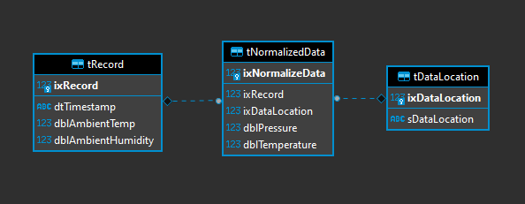

=============
Data Wrangler
=============

This module is to give you an idea of how you could take an excel
sheet and turn it into a relational database.

Excel to DB Conversion
----------------------

The excel file consists of the following headers:

- Timestamp
- Ambient Temperature
- Humidity
- Mixer Temperature
- Mixer Pressure
- Extruder Temperature
- Extruder Pressure
- Chilled Water Inlet Pressure
- Chilled Water Inlet Temperature
- Chilled Water Outlet Pressure
- Chilled Water Outlet Temperature

We can convert that into a normalized database like:

Table ``tDataLocation`` contains the following values:

+--------------+-----------------------+
|ixDataLocation|sDataLocation          |
+--------------+-----------------------+
|1             |Mixer                  |
+--------------+-----------------------+
|2             |Extruder               |
+--------------+-----------------------+
|3             |Chilled water Inlet    |
+--------------+-----------------------+
|4             |Chilled Water Outlet   |
+--------------+-----------------------+

You can see we were able to reduce the the four sets of Pressure and
Temperature pairs into a table and link their types to a seperate
table. This makes it a trivial matter to add more pairs of data and
still use the same code to run analysis.

Converting Columns to Normalized Tables
^^^^^^^^^^^^^^^^^^^^^^^^^^^^^^^^^^^^^^^

I used three techniques to make this conversion clean and avoid magic numbers.

- `dictionary <https://docs.python.org/3/tutorial/datastructures.html#dictionaries>`_
- Enum type `IntEnum <https://docs.python.org/3/library/enum.html?#enum.IntEnum>`_
- data class using `attrs <https://www.attrs.org/en/stable/examples.html>`_

This gives us the column map:

.. code-block:: python
    
    map_column_names = {
        # key: value
        ELoc.Mixer: NormColNames("Mixer Pressure", "Mixer Temperature"),
        ELoc.Extruder: NormColNames("Extruder Pressure", "Extruder Temperature"),
        ELoc.ChilledWaterInlet: NormColNames(
            "Chilled Water Inlet Pressure", "Chilled Water Inlet Temperature"
        ),
        ELoc.ChilledWaterOutlet: NormColNames(
            "Chilled Water Outlet Pressure", "Chilled Water Outlet Temperature"
        ),
    }

Which lets the code where we use it look like this:

.. code-block:: python
    
    # convert_extruder_data.py: def process_extruder()
        for key, value in map_column_names.items():
            record.norm_data.append(
                TNormalizedData(
                    ixDataLocation=key.value,
                    dblPressure=row[colnames.index(value.pres)],
                    dblTemperature=row[colnames.index(value.temp)],
                ),
            )

Interact with the DB
--------------------

You can use any python interactive shell, but I used `ptipython
<https://github.com/prompt-toolkit/ptpython>`_ which is ptpython and
ipython combined. Both ``ipython`` and ``ptpython`` can be installed
with ``pip``.

.. code-block:: python

    In [1]: %run convert_extruder_data.py -h
    usage: convert_extruder_data.py [-h] [--dblocation DBLOCATION] EXTRUDER_FILE
    
    Convert Extruder Data to SQL
    
    positional arguments:
      EXTRUDER_FILE         Extruder File [*.csv, *.xls, *.xlsx]
    
    optional arguments:
      -h, --help            show this help message and exit
      --dblocation DBLOCATION
                            path to sqlite file
    
    In [2]: # now we have the session variable from the end of convert_extruder_data.py in this interactive shell
    
    In [3]: # lets get the first record and explore the relationships that we created in SQL alchemy
    
    In [4]: rec = session.query(TRecord).get(1)
    
    In [5]: # if we want to see what's in `rec` we can type the var in the interactive
            # shell and it will automatically show us what it is with the repr() function
    
    In [6]: rec
    Out[6]: TRecord(ixRecord=1, dtTimestamp=datetime.date(2021, 4, 1), dblAmbientTemp=25.513465522275933, dblAmbientHumidity=50.0)
    
    In [7]: # That nice looking representation comes from the @generic_repr decorator we used on the SqlAlchemy model
    
    In [8]: # lets take a look at that relationship
    
    In [9]: rec.norm_data
    Out[9]:
    [TNormalizedData(ixNormalizeData=1, ixRecord=1, ixDataLocation=1, dblPressure=22.0, dblTemperature=150.0),
     TNormalizedData(ixNormalizeData=2, ixRecord=1, ixDataLocation=2, dblPressure=83.0, dblTemperature=165.0),
     TNormalizedData(ixNormalizeData=3, ixRecord=1, ixDataLocation=3, dblPressure=52.0, dblTemperature=20.0),
     TNormalizedData(ixNormalizeData=4, ixRecord=1, ixDataLocation=4, dblPressure=30.0, dblTemperature=27.0)]
    
    In [10]: # we have a list of the normalized pressure and temperature data
    In [11]: # what did those ixDataLocations represent again? let's use a list comprehension to find out
    
    In [12]: # a list comprehension is fast way to loop through data and can be used for filtering as well
    
    In [13]: [x.data_location for x in rec.norm_data]
    Out[13]:
    [TDataLocation(ixDataLocation=1, sDataLocation='Mixer'),
     TDataLocation(ixDataLocation=2, sDataLocation='Extruder'),
     TDataLocation(ixDataLocation=3, sDataLocation='Chilled Water Inlet'),
     TDataLocation(ixDataLocation=4, sDataLocation='Chilled Water Outlet')]
    
    In [14]: # the list comprehension looped through the list of `norm_data` and returned a list of TDataLocation
    In [15]: [x.data_location for x in rec.norm_data if "Chilled" in x.data_location.sDataLocation]
    Out[15]:
    [TDataLocation(ixDataLocation=3, sDataLocation='Chilled Water Inlet'),
     TDataLocation(ixDataLocation=4, sDataLocation='Chilled Water Outlet')]
    
    In [16]: # That was a bit contrived, but it does show some of the power of list comprehensions
